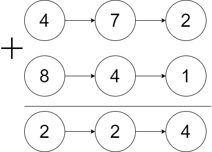
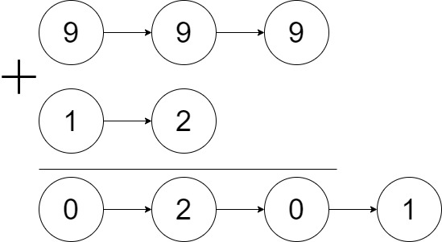
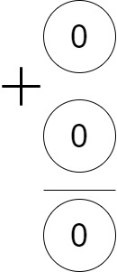

# Add Two Numbers

## Descrição do problema

Você recebe duas <i>linked list</i> não vazias representando dois números inteiros não negativos. Os dígitos são armazenados em ordem inversa e cada um de seus nós contém um único dígito. Some os dois números e retorne a soma como uma <i>linked list</i>.

Você pode assumir que os dois números não contêm nenhum zero à esquerda, exceto o próprio número 0.

## Exemplos

 
 

 
 

## Dicas

- Pense no algoritmo da soma que você que você aprendeu no ensino fundamental. Como você soma dois números grandes?

- Ao pensar no algoritmo acima, você deve ter se deparado com a situação em que você somou dois algoritmos equivalentes e soma deu maior que dez. O que fazer nessa situação?

- Como se pode implementar esse "vai um" ou "sobe um" no seu programa?

## Restrições

- O número de nós em cada lista encadeada está no intervalo [1, 100].
- 0 <= Node.val <= 9
- É garantido que a lista representa um número que não possui zeros à esquerda.

## Solução 

- Criar uma variável temporária "vaium" para armazenar a soma dos algoritmos iniciada em zero.
- Percorrer ambas as listas ao mesmo tempo somando ambos os valores do digito na variável "vaium".
- Adicionar o resto da divizão por 10 no node da solução.
- Manter a parte inteira do quociente da divisão por 10 na variável "vaium" para a próxima iteração.
- Repetir o processo enquanto existir node próximo da primeira lista, existir node próximo da segunda lista ou "vaium" ser diferente de zero.